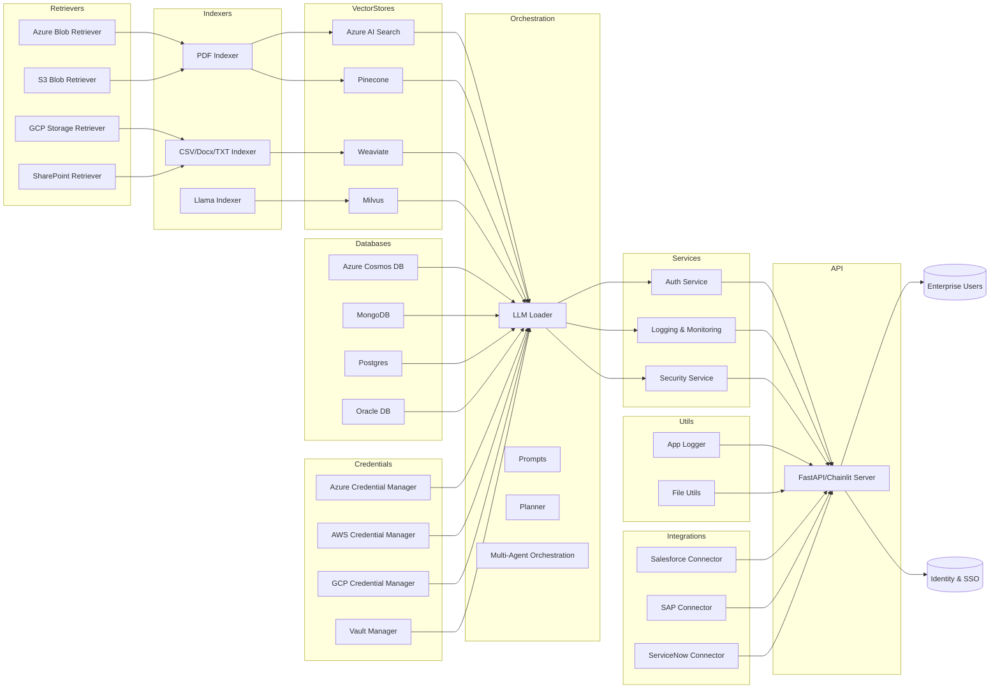

# Enterprise RAG Chatbot Backend Architecture

---

This diagram illustrates the modular backend architecture of the Agentic RAG Chatbot platform, designed for enterprise deployment across multi-cloud environments.

## Key Components

- **Retrievers**: Connect to cloud/on-prem storage (Azure Blob, S3, GCP, SharePoint).
- **Indexers**: Chunk and embed documents (PDF, CSV, DOCX, TXT, DataFrame).
- **Vector Stores**: Store embeddings (Azure AI Search, Pinecone, Weaviate, MongoDB).
- **Databases**: Metadata and persistence (CosmosDB, MongoDB, Postgres, Oracle).
- **Credentials**: Secure access to cloud platforms (Azure, AWS, GCP, Vault).
- **Orchestration**: Multi-agent planning, LLM loading, prompt management.
- **Services**: Auth, logging, monitoring, security.
- **Utils**: Logging, file utilities, wrappers.
- **Integrations**: Enterprise SaaS connectors (Salesforce, SAP, ServiceNow).
- **API Server**: FastAPI/Chainlit interface for enterprise users and identity systems.

## Architecture Flow

1. **Retrievers** pull files from cloud storage.
2. **Indexers** process and chunk documents.
3. Chunks are stored in **Vector Stores** and metadata in **Databases**.
4. **Orchestration** layer manages agentic flows and LLM interactions.
5. **Services** handle enterprise-grade auth, logging, and security.
6. **Integrations** connect to enterprise platforms.
7. **API Server** exposes chatbot interface to users and identity systems.

